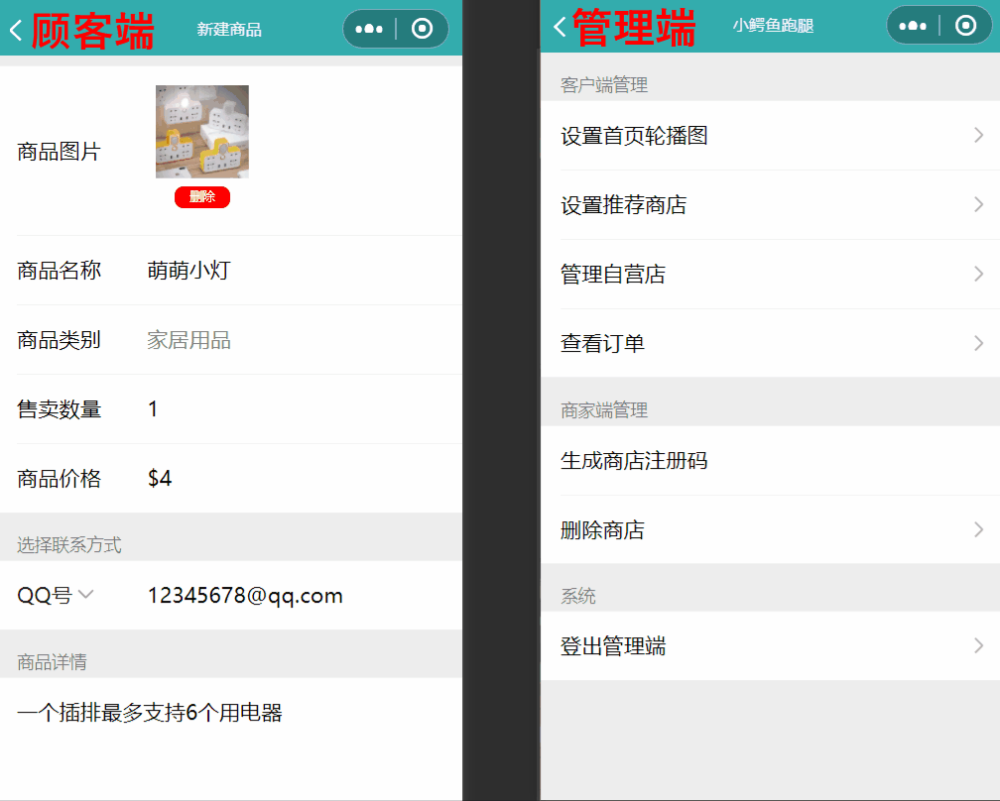

# 概述 Overview

2020年，新冠病毒的肆虐大幅降低了消费者的出行频率，商家的线下营业因而遭受了重创。不少商家因此将营业重心转向线上，通过无接触配送的方式来缓解病毒带来的影响。在此特殊时期，商家和消费者对线上外卖软件的需求日益增强。

In the year of 2020, the outbreak of COVID-19 has significantly decreased people's intention of hanging out, which was a disaster to offline business. Therefore, myriad shops has switched their focus of business from offline to online to mitigate the impact of COVID-19 by contactless delivery. During this unusual period of time, the importance of delivery apps kept growing. 

基于此，"小鳄鱼跑腿"项目于2020年7月成立，旨在搭建一个平台为美国迈阿密地区华人在疫情期间提供线上下单，线下送达的跑腿服务。

Based on that, the project, __Little Crocodile_ Delivery_, was created in the July of 2020 in order to build a platform and provide online ordering, offline delivery service to the Chinese people in Miami, US.

本项目基于微信小程序原生MINA框架进行开发，通过微信开发者工具提供的云开发功能实现前后端连接。后台数据库设计请参考[样例数据](样例数据/README.md)

This project is developed based on the original MINA framework of WeChat Mini-Program. The connection of front end and back end is made by Cloud Development provided by WeXin DevTool. Please refer to [sample data](样例数据/README.md) for the design of database

项目实现了三个用户终端：顾客端（C端）、商家端（B端）、管理端（A端）。三端全部集成在一个小程序中，用户可在小程序内进行切换。所有小程序用户都可以无条件进入顾客端，而只有在后台注册过商店的店主或店员才能进入商家端。管理端需要通过特殊的方式由在册的管理员输入专属密码才能够进入

 This project has implemented three user sides—— Customer Side (C-side), Business Side (B-side) and Administration Side (A-side). They are all integrated within the same mini program, where users can switch from one side to another. Every user can enter C-side without any condition. But only shop owners and shop assistants who have associated with a registered shop in database are able to enter B-side.  The administration side is only accessible to registered administrators with their own password.

如果您需要在此项目的基础上进行开发，请参考[工程导入教程](工程导入教程/README.md)

if you would like to develope your own program based on this project, please refer to [_Tutorial for importing this project_](工程导入教程/README.md)

三个终端的主要模块及其主要功能列举如下：

The main modules and features of the three sides are listed as follows:

### 顾客端 Customer Side
* 外送服务模块 Delivery Service Module
  * 购物车 Cart
  * 下单 Placing Orders 

* 跳蚤市场模块 Flea Market Module
  * 上传商品 Upload Merchandise

### 商家端 Shop Side
* 订单管理模块 Order Management Module
  * 接单 Order Taking
  * 处理 Order Handling 
  * 派送 Order Delivery
  * 取消 Order Cancellation

* 商店管理模块 Shop Management Module
  * 商品管理 Merchandise Management
  * 店员管理 Shop Assistant Management
  * 费用设置 Fee Setting
  * 营业设置 Operation Setting

### 管理端 Administration Side
* 顾客端管理模块 Administration-of-customer-side Module
  * 首页广告 Ads at Home Page
  * 跳蚤市场管理 Management of Flea Market
* 商家端管理 Administration-of-shop-side Module
  * 商店注册 Shop Registration
  * 商店排名 Shop Ranking
  
* 客服模块 Customer Service Module 
  * 查看订单 Access Order Information

# 主要业务流程演示 Demo of Main Business Process

## 顾客端 Customer Side
顾客端包括两条业务线：外送服务和跳蚤市场

The C-side has two main businesses: delivery service and flea market

### 外送服务流程 Procedure of delivery service:
浏览商品->添加商品至购物车->结算->选择收货地址->下单->等待送达。

find a product-> add to basket->checkout->select address->order placing->wait for delivery

### 跳蚤市场业务流程 Procedure of Flea-market Business 
点击“发布商品”->填写商品信息->上传->等待审核->通过审核商品上架->等待买主联系

click "upload"->provide product info->upload->wait for reviewing->approve->wait for buyer

如果商品未通过审核，顾客可以修改商品信息后再次提交审核，直至审核通过

if the product does not get approved, the customer may revise the product info, wait for the reviewing again and repeat this process until it gets approved.

## 商家端 Business Side
商家端的业务包括订单管理和商店管理

B-side includes the management of order and shop

### 订单管理 Order Management
收到新订单->接单->配货->派送
* 在商家未接单前，顾客可以随时取消订单
* 商家接单后，只有商家能取消订单。顾客若想取消订单需与商家电话联系

order receiving->order taking->order picking->delivery
* customers can cancel an order at any time before it is taken.
* if the order is taken, only the B-side has access to cancel it. Customers would have to make a phone call for cancellation.

### 商店管理 Shop Management 

店主对商店的管理主要分为商品管理，店员管理和营业设置。

Shop management of shop owners includes management of merchandise, shop assistant and operation setting

商品管理即为对商品信息的增加、删减、修改、查询、排序。在此不做演示

Shop owners' management of merchandise is the addition, deletion, modification, query, and sorting of merchandise information, which will not be displayed here.

同理，店主对店员的管理也可以概括为“增删改查”。其中，“改”指修改店员备注和权限。

Similarly, shop owners' management for shop assistants is also summarized as addition, deletion, modification and query 

店员的权限包括
* 处理订单 （接单-完成配货-完成派送）
* 修改商品信息 （商品名称，价格，起购数量等）
* 修改商店信息 （商店公告，是否开门等）

Shop assistants' access includes
* order handling (order taking-order picking-order delivery)
* modify merchandise info (name, price, minimum quantity etc.)
* modify shop info (announcement, open or close etc.)

添加一个新店员的流程为：商店管理tab页->店员管理->点击“+添加店员”获取邀请码->发送邀请码给店员->店员在商家端登录界面点击"成为店员"->输入邀请码->店员注册成功

The procedure of adding a shop assistant is: go to shop management tab->assistant management->click "+add assistant"->obtain invitation code->send to the assistant->the assistant clicks "become an assistant" at the login page of B-side->input invitation code->assistant registration successed

以下演示店主添加一个新店员的过程以及可以对店员进行的操作。

The demo below displays the procedure of adding a new assistant and what you can do to him.

## 管理端 Administration Side

管理端的业务包括对顾客端的管理和对商家端的管理。

A-side can manage C-side and B-side

管理端可以设置顾客端的首页轮播图广告，包括广告排序，广告语等。用户点击广告会自动跳转到广告所对应的商品详情页

A-side can set the ad at the home page of C-side. The setting includes ad sorting and ad slogan. When customers click the ad, they will automatically jump to the page with detailed info of the corresponding product. 

管理端对跳蚤市场的管理为审核用户上传的商品。商品通过审核后即可在跳蚤市场上架，以让所有顾客可见。如商品不能过审，管理员必须写明理由才可拒绝商品发布。

Management of flea market on A-side is the reviewing of the products uploaded by C-side. Products can enter the flea market and be accessed by every customer when it is approved on C-side.

管理端对商家端的管理主要为商店的注册和商店在顾客端首页“推荐商店”下的排名

Management of B-side on C-side involves shop registration and the rank of a shop under the "shop recommendation" module on C-side.

商店的注册流程与商家端店主添加店员的流程类似。管理端生成商店注册码后发给店主，店主在商家端登录页面点击“新商入驻”后输入注册码即可完成注册

The procedure to register a shop is similar with adding a new assistant. The C-side generates shop registration code and send it to a shop owner. The owner will then go to the login page of B-side, click "open a shop", input the code and finish the registration.  

管理端可以修改商家的排名值。排名值越高则排名越靠前

A-side can modify the ranking value of a shop. The higher the ranking value, the higher the shop ranks.

以下演示管理端审核用户上传的商品流程

the demo below displays the procedure of how C-side review the product uploaded by C-side.

