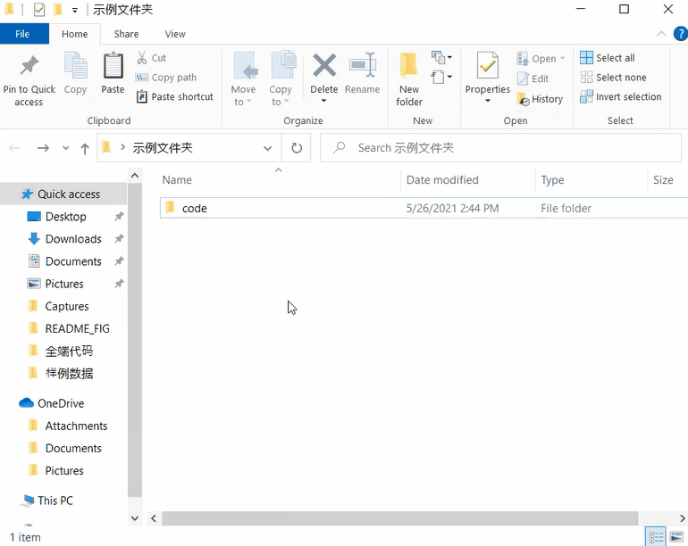
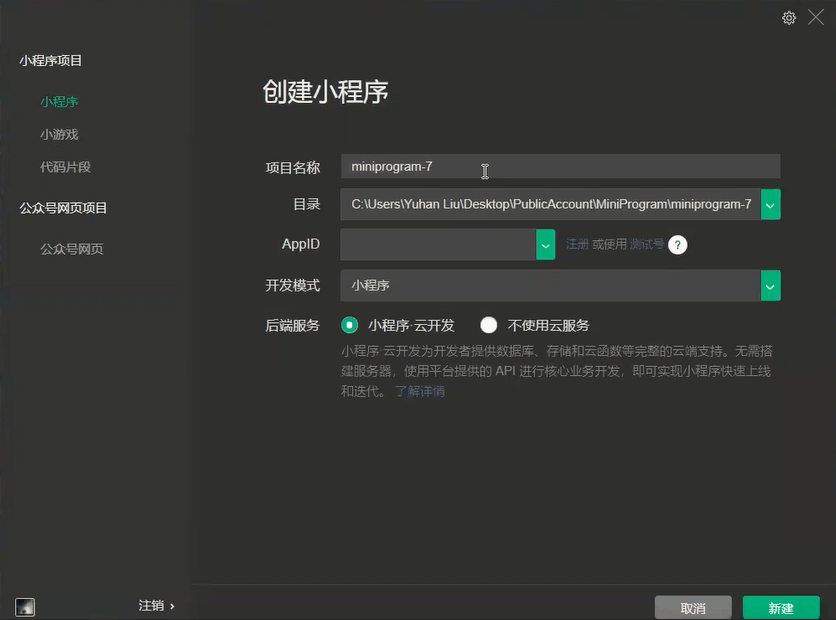
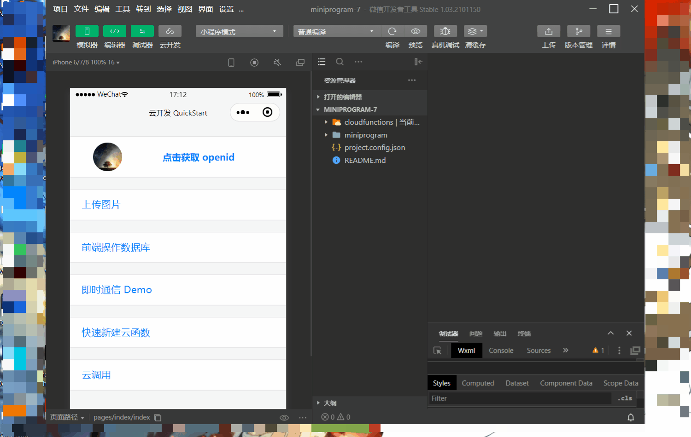
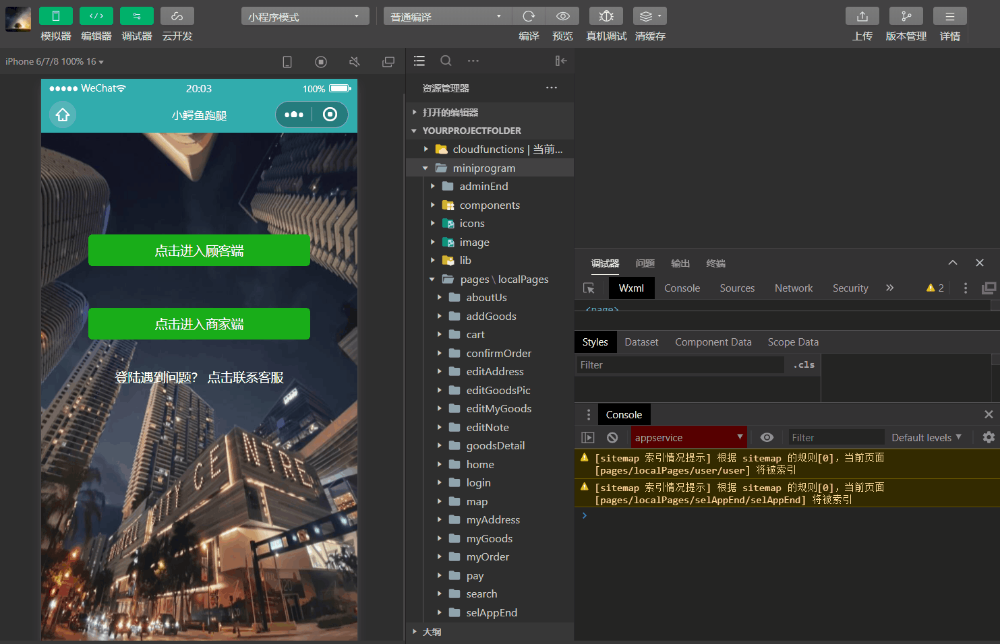

# 小白也能看懂的项目导入教程

如果你想把这个项目下载下来，跑通，并在此基础上做些修改的话，请参考这篇教程。

由于本项目用到了云开发，所以单纯地把代码下载下来然后在微信开发者工具里选择导入这个项目的话我们会遇到各种各样的问题，尤其是调试器会报找不到相关数据。所以除了导入相关代码，我们还需要将一些数据适配到当前的云环境中才能让相关函数跑通。

教程中每一步都有动图演示，请耐心等待加载或者下载后再阅读

#### 下载本项目并解压

不赘述

#### 建立本地工程目录
我这里的项目文件夹取名叫yourProjectFolder，实际根据自己的工程取名就好

#### 在微信开发者工具中新建工程

项目名称根据实际情况填写
目录就选择刚才我们创建的那个文件夹
填入自己的appid
确保勾选「小程序 云开发」
点击新建

#### 获取你的openid

openid是每个微信用户在微信小程序内的唯一识别码

点击新建后，开发工具会自动创建一个云开发的例子
在模拟器中点击 「点击获取openid」，然后在调试器中复制我们的openid，保存好。

你可以像我一样新建一个文本文件临时保存以下。如果你知道win+v可以查看剪贴板的话那其实也没必要专门新建一个文件

#### 获取你的云环境id

点击云开发，在云开发控制台中点击设置，复制云环境id

#### 将下载的项目代码复制到工程目录

删除工程目录下原有的文件后将此项目代码中的
* miniprogram 文件夹
* cloudfunctions 文件夹
* project.config.json

复制到工程目录下

#### 修改项目配置

1. 在开发工具搜索栏中搜索   wx2604ce53df094ce9
1. 点击搜索结果跳转到项目配置页面
2. 修改appid为我们现在的appid以及项目名称为现在的项目名称
3. 保存
4. 再搜索  env-miamielm-5gliunnq19c0a342
5. 将所有结果替换成现在的云环境id
6. 保存

#### 上传部署所有云函数

展开工程目录下第一个文件夹（cloudfunctions）

右键点击每一个函数并选择**上传并部署：云端安装依赖（不上传node_modules）**

#### 修改样例数据

进入「样例数据」文件夹。我这里让VScode从当前目录启动，这样我可以用Vscode在所有文件中查找替换

查找  oKXRg5euQbUoF74HQgN-FdJMwRSE
并将所有结果替换为我们现在的openid

这样一来这些数据就会被视作由你创建

#### 将修改后的数据导入云数据库

1. 打开云控制台
2. 选择云开发
3. 选择数据库
4. 删除小程序云开发自带的数据
5. 一个一个创建和样例数据同名的数据表
6. 将样例数据导入数据表并修改数据表权限为所有人可读写（后期可以根据需要修改数据表权限，这里为了保证程序跑通故意设置为所有人可读写）
7. 对所有的数据表进行同样的操作

至此，项目中用到的云函数和数据库数据已经成功适配了当前的云环境。小程序在此时已能运行，只是会报渲染错误的问题。这是因为在云存储中无法找到需要加载的图片。现在我们来解决这个问题

#### 修改跳蚤市场及登录页面背景图

1. 打开云开发控制台选择存储
2. 将「样例数据」文件夹下的「system」文件夹上传
3. 复制login.jpg, login2.jpg和fleaMarket.png的FileID

4. 打开数据库
5. 点击ugShop表格
6. 将logoUrl字段的值改为刚才复制的fleaMarket.png的FileID (win+V可以调出剪贴板)

7. 回到开发者工具编辑器，按ctrl+p，输入selAppEnd，点击selAppEnd.wxml跳转到对应文件
8. 将文件第二行image组件的src属性的值改为之前复制的login.jpg的FileID，然后保存
9. 同样通过ctrl+p输入login，点击miniprogram\ShopEnd\pages\localPages\login 下的login.wxml跳转到对应文件 (注意：动图里的跳转与这里不一致)
10. 同样修改第二行image组件的src属性值为login2.jpg的FileID
    

#### 设置首页轮播图

1. 如果现在处于顾客端，点击「我的」，下滑点击「登出客户端」
2. 进入商家端
3. 点击「新商入驻」
4. 输入aadminlogin1017进入管理端
5. 点击「设置首页轮播图」
6. 将原来空白的轮播图片删除
7. 点击「＋」上传新图片
8. 对轮播图片2执行同样的操作
9. 页面底部点击「保存」

#### 设置valencia连锁超市和chef chen中餐馆的商店logo

1. 打开云开发控制台
2. 新建名为「smBP9uFxmTxRv」和「smBxLqkKS9xxn」的文件夹
3. 在「smBxLqkKS9xxn」中上传logoValencia.jpg并复制FileID
4. 在「smBP9uFxmTxRv」中上传chefchen_logo.jpg并复制FileID

5. 打开数据库
6. 打开「shop」数据集
7. 查看第一条数据的shopName，如果是valencia连锁超市，则将该条数据下「logoUrl」字段的值改为logoValencia.jpg的FileID
8. 同理将另一条数据的「logoUrl」字段的值改为chefchen_logo.jpg的FileID

#### 设置商品图片（以无线小音箱为例）
1. 点击进入商家端
2. 点击「以店主身份登录」
3. 选择「valencia连锁超市」
4. 点击「商店管理」tab
5. 点击「商品管理」
6. 编辑「无线小音箱」
7. 在商品图片处点击删除
8. 点击「＋」
9. 上传「图片」文件夹中的小音箱图片

由于商品较多，一个一个的操作可能会比较麻烦。你也可以通过写代码的方式批量上传图片到云存储，获取它们的FileID再赋值给数据库里对应的商品。但是相比起来，手动上传图片可能还更方便一些

#### 结束

到此为止，除了各个商品的图片会报「渲染错误」外，整个程序应该能够正常跑通了。希望这个项目对你能有帮助。
